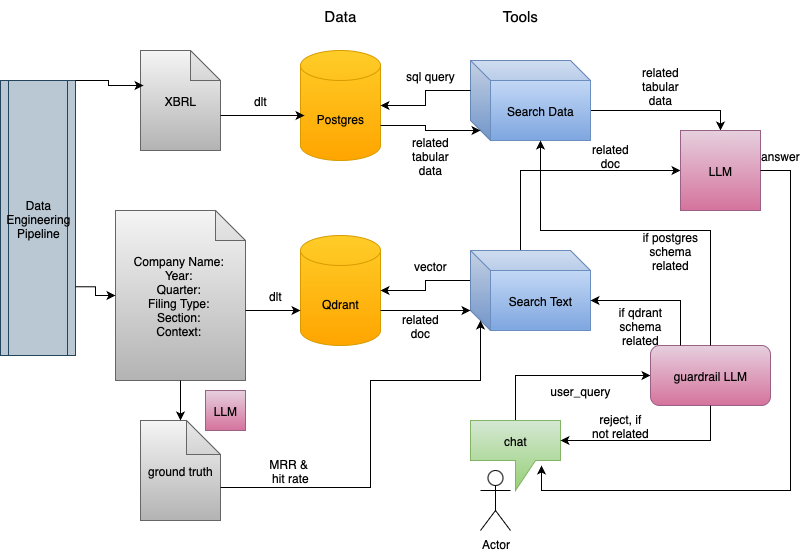

# Edgar RAG
## TODO
s3 -> qdrant   
xbrl -> postgres
rag pipeline   
evaluation/MRR and hit rate    
   
need some research   
evaluation/ground truth   
monitoring   
UI, streamlit

## flowchart


## data source
100 nasdaq companies, dated back to 2023 to make data shorter.   
text files from edgar 10k, chunk into sections   
text files from edgar 8k, whole text    
text files from edgar 10q, ???   
xbrl data into postgres database   

## data pipeline
dlt load json file from s3 to qdrant
dlt download xbrl data from yahoo and load into postgres   

## vector database
qdrant vector database   
under project folder, pull and run qdrant 
```
docker pull qdrant/qdrant
docker run -p 6333:6333 -p 6334:6334 \
   -v "$(pwd)/db.qdrant:/qdrant/storage:z" \
   qdrant/qdrant
```
in localhost:6333/dashboard
right side of data collection, click visualize
```
{
  "limit": 2000,
  "using": "fast-bge-small-en",
  "color_by": {
    "payload": "ticker"
  },
  "filter": {
    "must": [
      {"key": "section", "match": {"value": "Business"} }
    ]
  }
}
```

## agentic RAG
### gaurdrails layer
store descriptions of qdrant database and postgres database summary and schema in a file.    
ask LLM if user question is related to any of above database. 
if not domain related, reject response
if related to postgres, use search data function
if qdrant database related, use search text function
if none try your best

### workflow
search data function:   
provide postgres description, schema and user question   
ask LLM to generate a sql query    
parse sql query to postgres, and get response   
put response into LLM to generate a human readable answer   

search text function:   
embed user question, compare with vectors in qdrant   
respond with top 10 relevant documents   
put relavant documents into LLM to generate an human readable answer   
   
combine those answers if both related.    

## evaluataion
ground truth file for text
related doc -> possible question
generate gold truth file for search data   
example
question: what is tesla's last year revenue, answer: 97.7 billion  


## monitoring
???   

# Next Step
1, monitoring
2,log chat history. if user ask follow up question, feed history back in