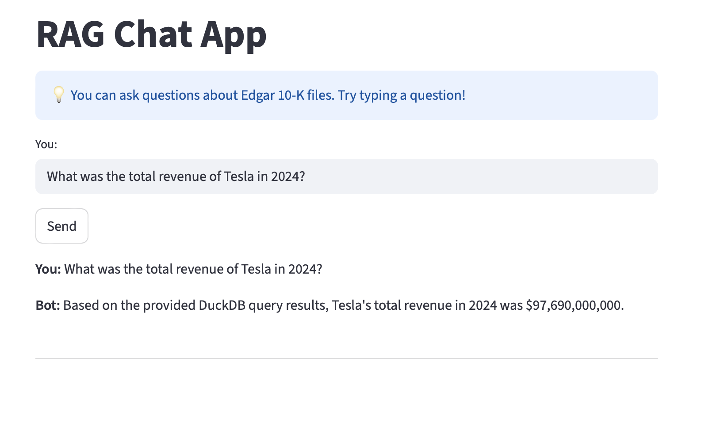

# Edgar RAG

## TODO
ground truth file router
metrics
% of correctly retrieved fields for duckdb eval
accuracy, f1 for router eval
fall back plan on downloading file to s3

monitoring

## description
This RAG project is built on public filings from EDGAR, designed to answer user questions.   
**Key challenges with EDGAR filings:**   
- Filings are provided in HTML or XML formats, rather than plain text or JSON.   
- Some document sections are placeholders without meaningful content.   
- Financial data is embedded in XBRL, making extraction and interpretation more complex.   

**Pipeline approach:**         
- Filings are downloaded into Amazon S3 and converted into vector embeddings stored in Qdrant.   
- XBRL financial data is extracted and loaded into DuckDB.   
- This setup enables answering questions that involve both narrative text and numerical data.   

**Why this approach:**      
While many modern chatbots rely on web search to retrieve answers,    
this project focuses on building a structured RAG pipeline.    
Once the pipeline is complete and tested, it can be extended to cover private companies, where data is either not publicly available or harder to obtain.    

## flowchart


## steps
1, setup environment. 
```
cd code
pip install -r requirements.txt
```
2, get gemini api key from google ai studio, see llm model section   
3, start qdrant server, see qdrant section   
4, load docs into qdrant by running text_pipeline.py   
note: i have aws access key in dot env file.    
      plan to add fallback logic to local if aws key not found    
5, load xbrl into duckdb by running xbrl_pipeline.py   
6, run rag_pipeline.py with question   
7, run evaluate_vector.py to get vector search metrics   
8, run evaluate_number.py to get number search metrics (doing)  
9, run evaluate_router.py to get llm router metrics (not done)      
10, streamlit run chat.py, and go to localhost:8501 to chat  
11, monitoring (not done)     

## data source
xbrl data from yahoo finance   
100 nasdaq companies, dated back to 2023 to make data shorter.   
text files from edgar 10k, chunk into sections   
text files from edgar 8k, whole text    
text files from edgar 10q, ???   

## data pipeline
download text files from edgar to s3   
dlt load json file from s3 to qdrant   
dlt download xbrl data from yahoo finance and load into duckdb       
update recent fiscal year end and filing date based on dlt incremental loading   

## vector database
qdrant vector database   
under project folder, pull and run qdrant 
```
docker pull qdrant/qdrant
docker run -p 6333:6333 -p 6334:6334 \
   -v "$(pwd)/db.qdrant:/qdrant/storage:z" \
   qdrant/qdrant
```
in localhost:6333/dashboard   
right side of data collection, click visualize   
```
{
  "limit": 2000,
  "using": "fast-bge-small-en",
  "color_by": {
    "payload": "ticker"
  },
  "filter": {
    "must": [
      {"key": "section", "match": {"value": "Business"} }
    ]
  }
}
```

## duckdb
schema:    
tables: company_info, financial_statement, balance_sheet, cashflow
dlt flattens company_info with two more child tables:       company_info__company_officer and company_info__corporate_actions   
there is a column '_dlt_parent_id' in child table to associate with '_dlt_id' in parent table.    
full schema see files/duckdb_schema.txt   

## llm model
i use google gemini model gemini-2.0-flash, which has a free tier.   
go to [google ai studio](https://aistudio.google.com/app/apikey) to get a free api key.   
then put in dot env file   
`GEMINI_API_KEY="<your_api_key>"`   
make sure to include double quotes.   

## vector search
in vector database, only text is embeded as vector, other fields are in payload.      
embed the question using the same model and then compare cosine similarity with the vector in qdrant.     
ticker and year filter is used.    

note: there are gaps between 10k file reporting date and fiscal year end date. now i am using last fiscal year in duckdb to get recent year. but the gap is actually common, because a lot of company has year end 12/31, so the fiscal year is previous year, but reporting year is next.    
plan to add a file to map ticker, fiscal year end, reporting date.


## agentic RAG
### routing layer
store descriptions of qdrant database and duckdb database summary and schema in a file.     
ask LLM if user question is related to any of above database.    
if not domain related, target = irrelant   
if related to duckdb schema, target = duckdb   
if qdrant database related, target = qdrant   
if both database related, target = both   
if company mentioned not in company list, target = not_in_list   

### workflow
search data function:   
provide duckdb description, schema and user question   
ask LLM to generate a sql query    
parse sql query to duckdb, and get response   
put response into LLM to generate a human readable answer   

search text function:   
embed user question, compare with vectors in qdrant   
respond with top 1 relevant documents   
put relavant documents into LLM to generate an human readable answer   
   
combine those answers if both related.    

## evaluataion
### qdrant vector search eval   
ground truth file for text   
related doc -> possible question -> doc_rag   
compare ground truth doc_id with doc_id in vector_search(gorund truth question)    
metric: hit rate and MRR   
hit rate:  0.8037066040198382   
mrr:  0.6763247193944136

### duckdb number search eval   
generate ground truth file for numbers     
example      
question: what is tesla's last year revenue, answer: 97,700,000,000     
tolerate level (1%)    
compare ground truth answer number with number_search(ground truth question)   
metric: % of correctly retrieval   

### router layer eval
from above two ground truth files, put questions in router layer, compare true target to router target.   
compare router llm generated target with ground truth retriever
compare router llm generated ticker list with ground truth ticker list.   
metric: accuracy, F1   

### full pipeline eval
ISSUE: units of number, could be billion, million, thousand, percent. have to convert to int if not percent, fload if percent. getting rid of dollar sign, percent sign.   
NOT DONE
combine above two ground truth files.    
compare rag(ground truth question) with ground truth answer text   
text metric: rouge    
number metric: accuracy   
combined score: 50% rouge_text + 50% accuracy_number if number exists    
rouge_text if number not exists    

## monitoring
NOT DONE   

## UI
streamlit   



# Next Step   
1, add 8k, 10q, 4 in doc sources   
2, monitoring   
3, log chat history. if user ask follow up question, feed history back in   
4, orchestration   
5, containerization   
6, deployment   